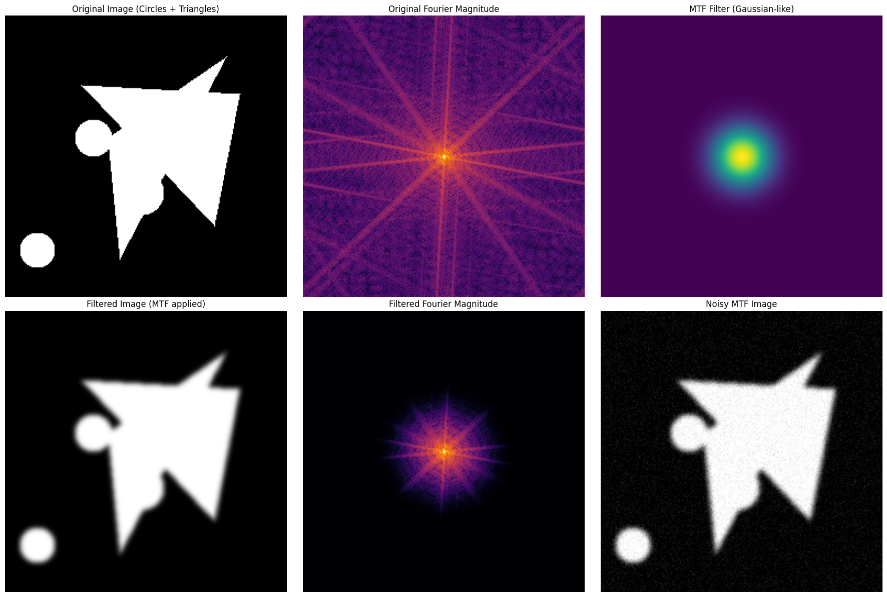
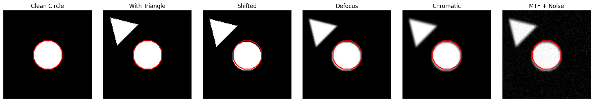
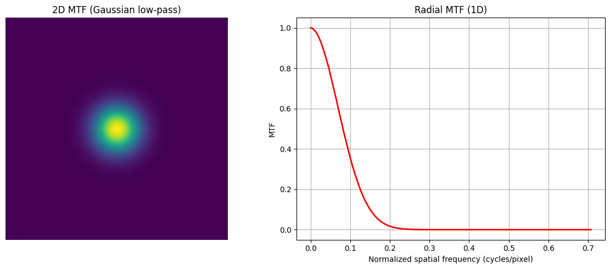
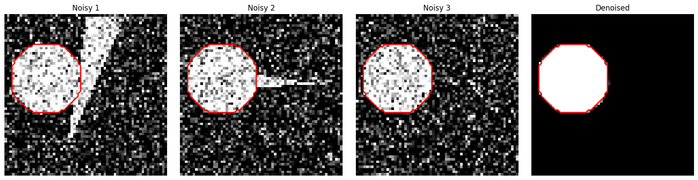
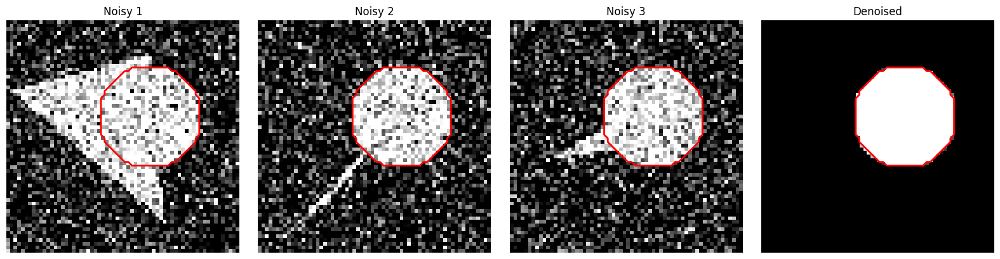

# EM-Circle-Denoiser

A synthetic Electron Microscopy (EM)-style dataset and CNN denoiser for circles.  
This repository simulates noisy EM images with realistic distortions, and trains a simple convolutional neural network to recover clean circles.


---

## 🌟 Concept

We simulate EM-style images using circles as target objects and optionally adding distractors (triangles). The simulation includes realistic microscopy effects:


### 1. Target and Distractors
- **Circle:** The object of interest. This is the "ground truth".
- **Triangles:** Random shapes to act as distractors in the field of view.

### 2. EM-Style Distortions

#### a) Small Shifts
- Random pixel translations to mimic sample or stage movement.

#### b) Defocus
- Gaussian blur applied to simulate out-of-focus imaging.

#### c) Chromatic Aberration
- Asymmetric Gaussian blur to simulate lens chromatic effects.

#### d) Modulation Transfer Function (MTF)
- Simulates how the microscope transfers spatial frequencies.
- High-frequency details are attenuated.
- Adds realistic EM-like noise and softens edges.


### 3. Multi-Input Denoising
- Each training sample has **3 noisy versions** of the same circle.
- Model learns to predict the **clean circle** from these noisy images.

---

## 🖼️ Example Visualization

The figure below shows the complete pipeline:

1. **Clean circle**  
2. **Triangle distractor added**  
3. **Shifted**  
4. **Defocus blur**  
5. **Chromatic aberration**  
6. **MTF + Gaussian noise**  

Red contours highlight the **true circle** at all stages.





---

### ✅ Example with Multi-Input Denoising

The model receives **3 noisy images** and predicts the **clean circle**:

## 📂 Repository Structure
```
EM-Circle-Denoiser/
├── README.md                  # This file
├── requirements.txt           # Python dependencies
├── dataset.py                 # CircleDatasetEM with EM-style noise
├── model.py                   # CNN denoiser
├── train.py                   # Training loop
├── visualize.py               # Plotting with highlighted circles
├── utils.py                   # Weighted MSE loss and helpers
└── images/
    └── example_pipeline.png   # Figure for README
└── examples/
    └── sample_visualization.ipynb  # Optional notebook for demos

```

⚡ Installation & Usage

Clone the repository:
```

git clone https://github.com/cuauhtemoc/EM-Circle-Denoiser.git
cd EM-Circle-Denoiser
```


Install dependencies:
```
pip install -r requirements.txt
```

Train the model:
```
python train.py
```

Visualize results:
```
python visualize.py
```
## Notes

MTF simulation: Applies a Fourier-domain filter, attenuating high frequencies and simulating microscope optics.

Defocus: Gaussian blur represents out-of-focus imaging.

Chromatic aberration: Asymmetric blur mimics lens dispersion effects.

Multi-input denoising: Model learns to average out random noise across multiple observations.

Contours in red: Make it easy to see where the target circle is at every stage.

